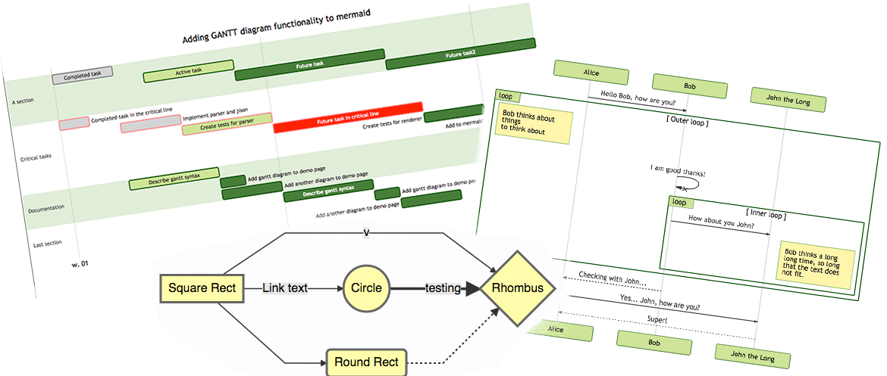

OpenArchi
===

ToC
===
  * [Brief description](#brief-description)
  * [OpenArchi in a Nutshell](#openarchi-in-a-nutshell)
  * [Tools](#tools)
  * [AMaaS (Architecture Model as a Service)](#amaas-architecture-model-as-a-service))
  * [Inspiration](#inspiration)

Brief description
===

Open Archi is a social network for the management of enterprise architecture, using the concept of AMaaS - Architecture Model as a Service, including:

* Knowledge base of architectural components
* Intergration with the main business concepts (TOGAF and C4Model based Architecture Framework):
  * Enterprise Architecture
  * Applications Architecture
  * Data Architecture
  * Technological Architecture
* Whole capabilities fully APIfied
* Administration and interrelation of component thru DevOps
* Automation of communication about its evolution
* Ease of design of architectural models
* Collaborative construction
* Automation of the application of business rules related to enterprise architecture

OpenArchi in a Nutshell
===

Tools
===

[**Api**](http:/www.open-archi.com/api) for open-archi model management

A graphical [**editor**](http:/www.open-archi.com/prototyper) to compose and reuse architecture diagrams

AMaaS (Architecture Model as a Service)
===

Taking into consideration the philosophy that has to support the concept behind Architecture as a Service Models (AMaaS) we could say that this, embodied in Open-Archi, should consider:

**Open CRUD.** In a social network of business architecture the whole community is the one who maintains it. That is, each aspect of your taxonomy comes from the community (Wiki style), not from a group.

**Usable by all.** If all the members of the organization have to participate, a single form of interaction that requires specific technical knowledge can not be provided. Users of functional, business, commercial, administrative or technical nature should be able to come together in a common language and tools. This is where technologies and formidable precepts such as Unified Modeling Language (UML), ArchiMate, arc42 or SysML might not be enough, or at least not cover all potential consumers.

**Omniscience and transversality.** Anyone within the organization can "edit" or "create" content. Another can undo or alter this edition. With continuous use, the "real" possible information will be revealed, but not only on the technological point of view. With Open-Archi you could relate even a specific class (OOP) to a strategic goal that the organization is trying to achieve.

**Omnipresence.** Open-Archi is present at all times. Each piece of information (not only technological) can be archived independently for a specific project, asynchronously. But all those small pieces of disconnected information may, in the future, feed the design of a general or specific solution. The information is fed automatically or manually, from and to Open-Archi in an agnostic way to a particular project or scenario. That is, with Open-Archi the business architecture always evolves.

**Ease of integration.** It exposes all its functionalities through an API layer so that anyone can manage the knowledge base of the components of the business architecture or integrate it into their pipelines (DevOps).

**IDE.** Tool that will integrate all the functions required to operate with business architectures, both from the graphic point of view as information exchange and modification of the behavior of the models.

**Identity.** Each component is unique. Two elements of the same type can not be repeated with the same name, however, it can be reused in any type of model or diagram that is desired. In addition each element can be only one of 4 possible types: A layer, a system, a container or a component, all in a hierarchical relationship, where one contains the other which can be, in turn, a high level element with sub-elements inside. Regardless of the type of diagram you want to design, everything will be conceived as a model of identical characteristics, where, for each of the components, a uniform color and shape code applies. In this way, all elements of type "component" have the same graphic aspect, the same for all "layer" type elements. Additionally, a complementary iconography can be defined that can differentiate one of these elements. With such conventions the criterion of interpretation of the models can be unified by all the participants.

Inspiration
===

For the conception of Open-Archi I have been inspired by 3 formidable initiatives:

The amazing [**AWS Cloudcraft**](https://cloudcraft.co) architectures design tool. If you have designed a solution in AWS, you will have used it before. But, do not waste any more time with other tools, try it out and you'll see how simple it is to have all the power of AWS services in a single design canvas.

The flexible abstraction of the [**C4-Model**](https://c4model.com) proposed by Simon Brown for the design of architectures. Brown proposes that with 4 basic elements (systems, containers, components and classes) one can, recursively, model any architecture. It also makes us reflect on the difference between semantic modeling (with respect to the technical and functional interdependencies of architectural pieces) and simple diagramming.

The proposed interrelation of functional, non-functional, business and technical elements for the design of enterprise architectures present in the [**ArchiMate**](https://publications.opengroup.org/c134) specification and the [**TOGAF framework**](https://publications.opengroup.org/c182)

The capability of generating diagrams from text as a simple markdown-like script as it is done by [**Mermaidjs**](https://mermaidjs.github.io)

The integration of these initiatives results in the conception of this social network that seeks to satisfy the need for all functional and technical areas and all business units to make available to the entire organization the information they handle in their area of competence, so the teams that design business solutions can find unified everything necessary for effective decision-making, regarding business architecture

Under the hood
===

The class model for making all this possible looks like this:

